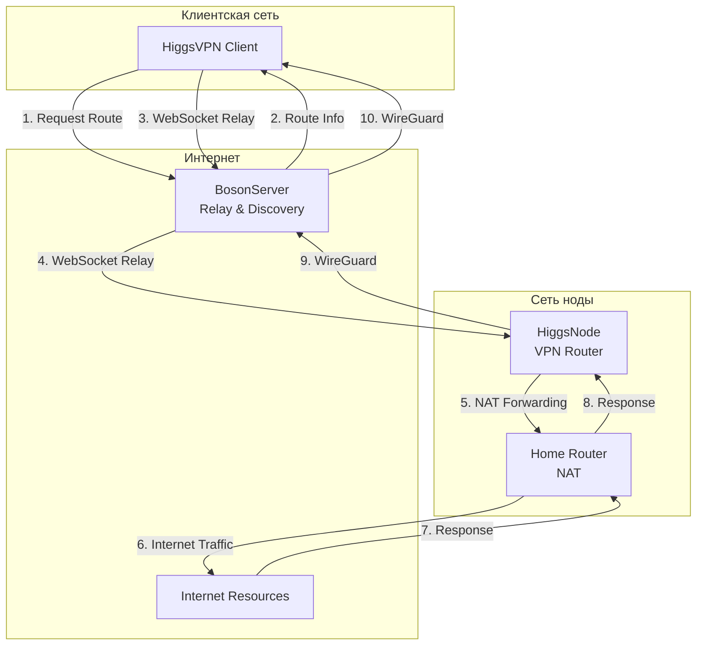
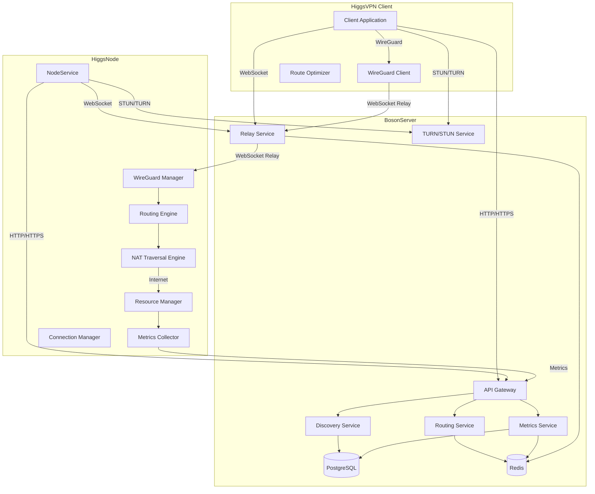
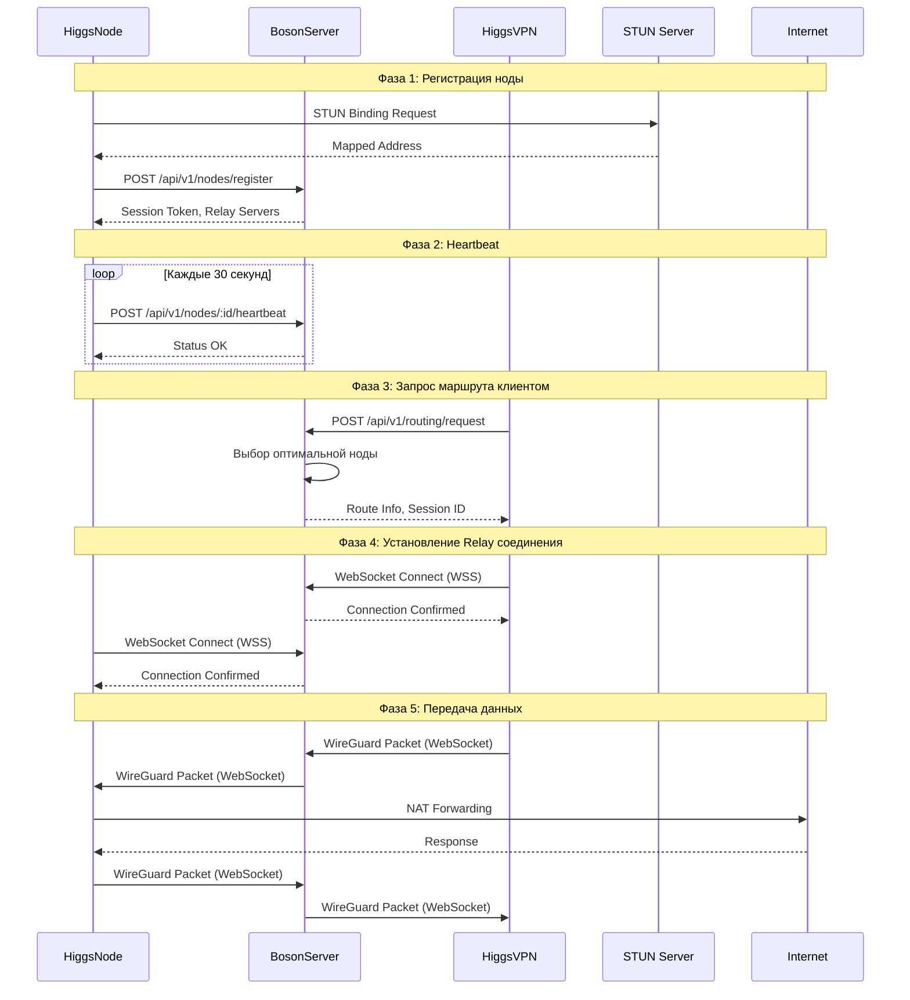
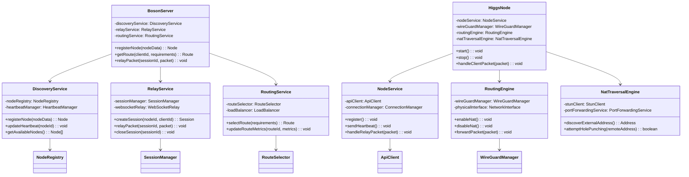
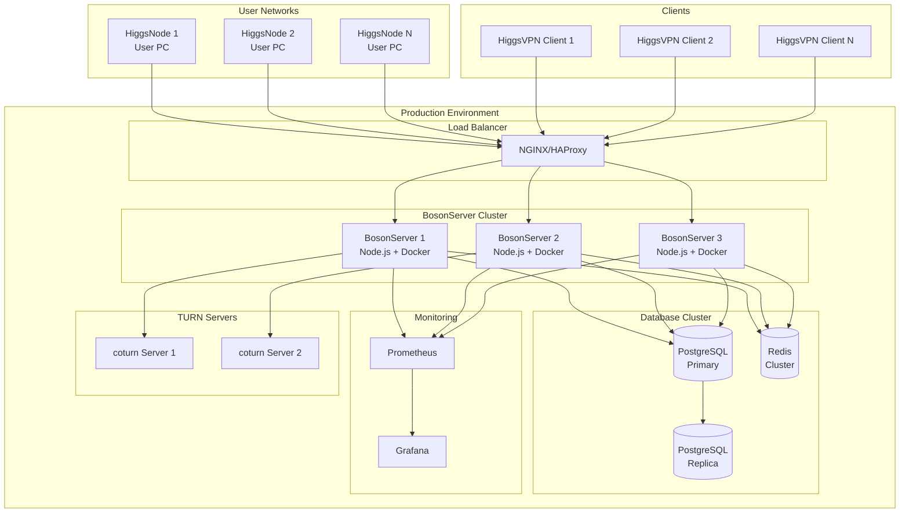
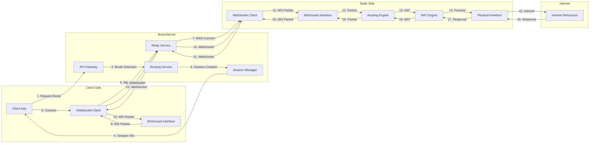

# Higgs.net - Децентрализованная VPN Сеть

[](LICENSE)
[](https://www.typescriptlang.org/)
[](https://nodejs.org/)

**Higgs.net** — это децентрализованная VPN-сеть, построенная на пользовательских нодах за NAT. Система обеспечивает безопасное и эффективное соединение между клиентами и нодами через централизованные relay-серверы с публичными IP-адресами.

## 📋 Содержание

- [Архитектура системы](#архитектура-системы)
- [Основные компоненты](#основные-компоненты)
- [Диаграммы системы](#диаграммы-системы)
- [Анализ проблемных мест](#анализ-проблемных-мест)
- [Быстрый старт](#быстрый-старт)
- [Документация](#документация)

---

## Архитектура системы

Система состоит из трех основных компонентов:

1. **BosonServer** — центральный сервер с публичным IP для NAT traversal и маршрутизации
2. **HiggsNode** — нода на ПК пользователя для маршрутизации трафика
3. **HiggsVPN** — клиентское приложение (desktop/mobile)

### Общая схема взаимодействия



---

## Основные компоненты

### BosonServer

Центральный сервер, обеспечивающий:
- Регистрацию и обнаружение нод
- NAT traversal через STUN/TURN
- Relay трафика между клиентами и нодами
- Маршрутизацию и балансировку нагрузки
- Мониторинг и метрики

### HiggsNode

Нода на ПК пользователя, выполняющая:
- Регистрацию на BosonServer
- Открытие локального WireGuard порта
- Маршрутизацию и NAT трафика от клиентов
- Сбор и отправку метрик
- Управление ресурсами ПК

### HiggsVPN

Клиентское приложение для:
- Подключения к нодам через BosonServer
- Управления WireGuard соединениями
- Мониторинга качества соединения
- Пользовательского интерфейса

---

## Диаграммы системы

### 1. Диаграмма компонентов системы



### 2. Диаграмма последовательности: Регистрация ноды и подключение клиента



### 3. Диаграмма классов основных компонентов



### 4. Диаграмма развертывания



### 5. Диаграмма потока данных (Data Flow)



---

## Анализ проблемных мест

### 🔴 Критические проблемы (Приоритет 1)

#### 1. Неправильная настройка NAT и маршрутизации

**Проблема:**
В текущей реализации NAT настроен неправильно. Правила iptables применяются к неправильному интерфейсу, что приводит к невозможности маршрутизации трафика от клиентов в интернет.

**Текущая реализация:**
```bash
iptables -t nat -A POSTROUTING -o ${wireguardInterface} -j MASQUERADE
```

**Правильная реализация:**
```bash
# Определить физический интерфейс
PHYSICAL_IF=$(ip route | grep default | awk '{print $5}' | head -1)

# NAT от WireGuard к физическому интерфейсу
iptables -t nat -A POSTROUTING -i ${WIREGUARD_IF} -o ${PHYSICAL_IF} -j MASQUERADE

# Разрешить forwarding между интерфейсами
iptables -A FORWARD -i ${WIREGUARD_IF} -o ${PHYSICAL_IF} -j ACCEPT
iptables -A FORWARD -i ${PHYSICAL_IF} -o ${WIREGUARD_IF} -m state --state RELATED,ESTABLISHED -j ACCEPT
```

**Последствия:**
- ❌ Трафик от клиентов не маршрутизируется в интернет
- ❌ Клиенты не могут получить доступ к внешним ресурсам
- ❌ Обратный трафик не возвращается клиентам

**Решение:**
- Исправить направление NAT правил (от WireGuard к физическому интерфейсу)
- Добавить автоматическое определение физического интерфейса
- Добавить проверку правильности настройки при старте

#### 2. Отсутствие механизма перехвата и перенаправления пакетов

**Проблема:**
В текущей реализации отсутствует механизм, который перехватывает пакеты от клиентов через WireGuard интерфейс и перенаправляет их на физический интерфейс.

**Что отсутствует:**
- WireGuard получает пакеты от клиентов, но они не перенаправляются автоматически
- Нет обработчика для пакетов, которые должны идти в интернет
- Нет механизма определения default gateway для физического интерфейса

**Последствия:**
- ❌ Пакеты от клиентов теряются
- ❌ Даже при правильном NAT трафик не выходит в интернет
- ❌ Клиенты не могут получить доступ к внешним ресурсам

**Решение:**
- Добавить packet forwarding handler
- Реализовать route table management
- Добавить автоматическое определение default gateway

#### 3. Проблемы с правами доступа (Root/Administrator)

**Проблема:**
Для работы VPN ноды требуются привилегированные права на всех платформах.

**Последствия:**
- ⚠️ Пользователи должны запускать приложение с правами администратора
- ⚠️ Потенциальные риски безопасности
- ⚠️ Сложность установки и использования

**Решение:**
- Использовать Linux capabilities вместо полного root
- Создать systemd service с ограниченными правами
- Использовать polkit для запроса прав при необходимости
- Для Windows: использовать UAC elevation только при необходимости

### 🟡 Важные проблемы (Приоритет 2)

#### 4. Двойной NAT (Double NAT)

**Проблема:**
Когда HiggsNode находится за NAT роутера, возникает двойное преобразование адресов.

**Последствия:**
- ⚠️ Увеличение latency
- ⚠️ Проблемы с некоторыми протоколами (FTP, SIP, игровые протоколы)
- ⚠️ Сложность отладки сетевых проблем

**Решение:**
- Использовать UPnP/IGD для проброса портов на роутере
- Поддержка NAT-PMP (macOS/iOS)
- Рекомендации пользователю настроить port forwarding вручную
- Использовать TURN relay для обхода NAT

#### 5. Производительность WebSocket Relay

**Проблема:**
Трафик проходит через WebSocket relay, что добавляет overhead и увеличивает latency.

**Накладные расходы:**
- WebSocket overhead: ~14 байт на фрейм
- JSON encoding для control messages
- Base64 encoding для бинарных данных (в текущей реализации)
- Дополнительная задержка через relay сервер

**Последствия:**
- ⚠️ Увеличение latency на 50-200ms
- ⚠️ Снижение пропускной способности на 5-10%
- ⚠️ Дополнительная нагрузка на CPU

**Решение:**
- Использовать бинарные WebSocket фреймы вместо base64
- Реализовать packet batching для уменьшения overhead
- Приоритизировать прямые P2P соединения (UDP Hole Punching)
- Использовать TURN вместо WebSocket для лучшей производительности

#### 6. Проблемы с MTU (Maximum Transmission Unit)

**Проблема:**
При туннелировании через WebSocket происходит фрагментация пакетов из-за неправильного MTU.

**Последствия:**
- ⚠️ Фрагментация пакетов увеличивает latency
- ⚠️ Снижение пропускной способности
- ⚠️ Потенциальные проблемы с некоторыми приложениями

**Решение:**
- Автоматическое определение оптимального MTU (Path MTU Discovery)
- Настройка MTU для WireGuard интерфейса с учетом WebSocket overhead
- Адаптивная настройка MTU на основе метрик

#### 7. Безопасность и приватность

**Проблема:**
HiggsNode видит весь трафик клиентов, включая метаданные.

**Последствия:**
- ⚠️ Потенциальная утечка данных о клиентах
- ⚠️ Возможность логирования трафика
- ⚠️ Юридические риски для владельцев нод

**Решение:**
- Zero-knowledge архитектура - нода не должна видеть содержимое трафика
- End-to-end шифрование - дополнительный слой шифрования поверх WireGuard
- Прозрачная политика - четкое информирование о том, что логируется
- Опциональное логирование - только метаданные, без содержимого

#### 8. Проблемы с DNS

**Проблема:**
В текущей реализации нет явной обработки DNS запросов.

**Последствия:**
- ⚠️ DNS запросы могут идти мимо VPN (DNS leak)
- ⚠️ Проблемы с геоблокировкой контента
- ⚠️ Потенциальные проблемы с безопасностью

**Решение:**
- DNS interception - перехват DNS запросов на ноде
- DNS forwarding - перенаправление на безопасные DNS серверы
- DNS over HTTPS/TLS - использование DoH/DoT
- Настройка DNS в WireGuard конфигурации клиента

### 🟢 Улучшения (Приоритет 3)

#### 9. Конфликты с существующими firewall правилами

**Проблема:**
При добавлении правил iptables/pfctl могут возникнуть конфликты с существующими правилами.

**Решение:**
- Использовать отдельную цепочку iptables для HiggsNode
- Сохранение и восстановление правил перед изменением
- Graceful cleanup - удаление правил при остановке
- Проверка конфликтов перед добавлением правил

#### 10. Проблемы с IPv6

**Проблема:**
Текущая реализация фокусируется на IPv4.

**Решение:**
- Добавить поддержку IPv6 NAT (NAT66 или NPTv6)
- Настроить IPv6 forwarding
- Поддержка dual-stack конфигураций

#### 11. Управление ресурсами и ограничения

**Проблема:**
Нет контроля пропускной способности и ограничений на количество соединений.

**Решение:**
- Traffic shaping с использованием `tc` (Linux)
- Per-client rate limiting
- Connection limits на клиента
- QoS правила для приоритизации трафика

#### 12. Проблемы с восстановлением после сбоя

**Проблема:**
При сбое ноды правила iptables и маршруты могут остаться активными.

**Решение:**
- Graceful shutdown - очистка всех правил при остановке
- Signal handlers - обработка SIGTERM, SIGINT для очистки
- Health checks - автоматическое восстановление
- Cleanup scripts - скрипты для очистки при необходимости

---

## Быстрый старт

### Требования

- Node.js 20.x или выше
- Docker и Docker Compose (для BosonServer)
- WireGuard (для HiggsNode и клиентов)
- Права администратора/root (для HiggsNode)

### Установка BosonServer

```bash
cd bosonserver
docker-compose up -d
```

Подробная документация: [bosonserver/README.md](bosonserver/README.md)

### Установка HiggsNode

```bash
cd higgsnode
npm install
npm run build
sudo npm start
```

Подробная документация: [higgsnode/README.md](higgsnode/README.md)

---

## Документация

- [Архитектура системы](ARCHITECTURE.md) - детальное описание архитектуры
- [Протокол передачи данных](PROTOCOL.md) - описание протоколов и API
- [Анализ проблем VPN](VPN_ISSUES_ANALYSIS.md) - детальный анализ проблем
- [Рекомендации по улучшению](IMPROVEMENT_RECOMMENDATIONS_IMPORTANT.md) - рекомендации по решению проблем
- [API документация](bosonserver/API.md) - REST API документация

---

## Статус проекта

⚠️ **Проект в активной разработке**

Текущая версия имеет критические проблемы с маршрутизацией и NAT, которые делают невозможным использование системы в production без исправлений. См. раздел [Анализ проблемных мест](#анализ-проблемных-мест) для деталей.

### План исправлений

1. **Фаза 1 (Критично):** Исправление NAT и маршрутизации
2. **Фаза 2 (Важно):** Оптимизация производительности и безопасности
3. **Фаза 3 (Улучшения):** Дополнительные функции и оптимизации

---

## Лицензия

MIT License - см. [LICENSE](LICENSE) файл для деталей.

---

## Контакты

- **Репозиторий:** [https://github.com/shepherdvovkes/Higgsvpn](https://github.com/shepherdvovkes/Higgsvpn)
- **Issues:** [GitHub Issues](https://github.com/shepherdvovkes/Higgsvpn/issues)

---

*Последнее обновление: Декабрь 2024*

